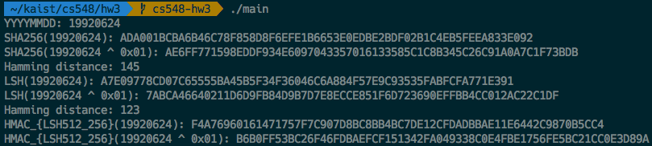

# CS548 Advanced Information Security HW 3

KAIST SoC 20163204 남상규 (Sanggyu Nam)

## Problems

1. For SHA-256 and LSH512_256 (Lightweight Secure Hash), compare hash value of

    (i) M1 = (dec->bin)YYYYMMDD, which is your birthday and

    (ii) M2 = M1 XOR 1 (i.e. last bit of binary(your birthday) is going to be changed)

    and check the avalanche effect. You should get Hamming distance between `SHA-256(M1)` and `SHA-256(M2)` as well as `LSH(M1)` and `LSH(M2)`.

2. For LSH512\_256, calculate `HMAC_{LSH512_256} (M1)` and `HMAC_{LSH512_256} (M2)`.

## Results

I wrote a C program that reads a date in the form of eight digits YYYYMMDD (e.g., 19920624) from `stdin` and print the hash values of and Hamming distances between M1 and M2 using SHA-256 and LSH512_256 to `stdout`. For the convenience of grading, I have prepared a screenshot image file named `results.png` of the results in the root directory.

If you are on *nix environment, just type `make` on your shell to build the program, then a binary file named `main` will be created on the same directory.

This program uses the implementation of SHA-256 and LSH available at [KISA website](https://seed.kisa.or.kr/iwt/ko/bbs/EgovReferenceList.do?bbsId=BBSMSTR_000000000002). Since this SHA-256 implementation needs a macro definition of endianness and I am pretty sure your (especially, the TA) system's architecture is x86_64, I set an option for C compiler to define a macro for endianness to be **little endian**.

For calculating the Hamming distance of two hash values, [GCC builtin function](https://gcc.gnu.org/onlinedocs/gcc/Other-Builtins.html) named `__builtin_popcountll()` is used for calculating the Hamming weight of the XOR value of the hash values. This function is also available in [clang](http://clang.llvm.org/).

Also, since there is no constraint on the key of HMAC, I used the first verse of the song 'Sunday Morning' by Maroon 5 as the key. 😀