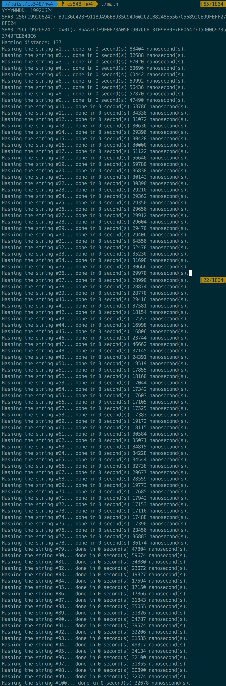

# CS548 Advanced Information Security HW 4

KAIST SoC 20163204 남상규 (Sanggyu Nam)

## Problems

1. Like HW3, find `h(m1) = SHA-3 (yyyymmdd)` and `h(m2) = SHA-3 (yyyymmdd XOR 1)` and **check avalanche effect by checking Hamming distance between `h(m1)` and `h(m2)`.**

2. Check the execution time for 100 random bit strings with same length 1 kilo byte (1000 byte), then **confirm that SHA-3 is secure against timing attacks.**

## Results

I wrote a C program that reads a date in the form of eight digits YYYYMMDD (e.g., 19920624) from `stdin` and print the hash values of and Hamming distances between M1 and M2 using SHA-3 to `stdout`. For the convenience of grading, I have prepared a screenshot image file named `results.png` of the results in the root directory.

If you are on *nix environment, just type `make` on your shell to build the program, then a binary file named `main` will be created on the same directory.

This program uses **[Keccak Code Package](https://github.com/gvanas/KeccakCodePackage)** (KCP) for SHA-3 hashing. Those are some features of KCP:

* KCP provides multiple versions of Keccak (SHA-3) implementation optimized for various platform.
* KCP contains static library `libkeccak.a`, self tests, and hash generator for file(s).
* KCP has capability of generating a package with required file for a target in `.tar.gz` archive.

For this homework, I built the package for `libkeccak.a` optimized for generic 64-bit platform. The result is `generic64_libkeccak.a.tar.gz`. Building my program starts with extracting source files from this archive into directory `keccak/`, and then these files and my source code file are compiled and linked.

For calculating the Hamming distance of two hash values, [GCC builtin function](https://gcc.gnu.org/onlinedocs/gcc/Other-Builtins.html) named `__builtin_popcountll()` is used for calculating the Hamming weight of the XOR value of the hash values. This function is also available in [clang](http://clang.llvm.org/).

To measure the time elapsed for single iteration in the second problem, I used a POSIX.1-2001 function named `clock_gettime()` which retrieves the current time in nanosecond precision. However, macOS prior to version 10.12 does not support this function. Therefore, I used [a workaround](https://gist.github.com/jbenet/1087739) for this absence, which uses some functions available in Mach kernel headers.